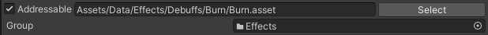
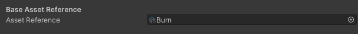
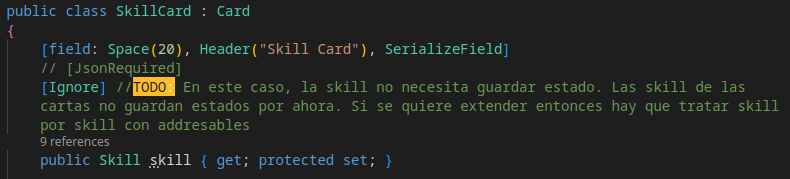
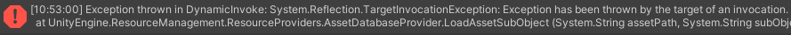

# Sistema de Guardado

Para el sistema de guardado del proyecto se ha deicido utilizar la biblioteca [Newtonsoft.Json](https://docs.unity3d.com/Packages/com.unity.nuget.newtonsoft-json@3.0/manual/index.html) por su flexibilidad superior a otras bibliotecas comunmente utilizadas como [JsonUtility](https://docs.unity3d.com/2020.1/Documentation/Manual/JSONSerialization.html).

Para entender como fuciona el sistema de guardar datos en Arcane se deben explicar detalles importantes de la biblioteca [Newtonsoft.Json](https://docs.unity3d.com/Packages/com.unity.nuget.newtonsoft-json@3.0/manual/index.html) que se usa como base para todo nuestro sistema de guardado y de datos persistentes.

## Newtonsoft.Json

Newtonsoft’s Json.NET is a popular high-performance JSON framework for .NET that can be used with Unity; similar to Unity’s Json Utility
but with other features. Caracteristicas, de las cuales, cada una de las utilizadas, se documentan en esta seccion.

- `Newtonsoft.Json` serializa campos de las clases que sean publicos o propiedades que tengan `get` o `set` publicos. Las propiedades pueden ser solo lectura o solo escritura, solamente con una de estas opciones publicas, por defecto se serializa la propiedad. Es importante tener esto en cuenta ya que, generalmente, las propiedades de solo lectura no se desean serializar.
  
- `Newtonsoft.Json` no permite la serializacion circular, es decir, no se puede serializar "recursivamente". Por ejemplo, si existe un `Hero` que tiene un campo `Skill`, y `Skill` tiene un campo `Hero`, entonces la serializacion se hace circular y se rompe, ademas dado que se necesita trabajar con referencias, aunque no se rompiera, igual no serviria, ya que la biblioteca no guarda referencias, sino datos no relacionales en formato JSON. Para tratar estos problemas se plantean soluciones especificas para el proyecto.

`Newtonsoft.Json` es utilizado por razones de flexibilidad de nuestros datos, flexibilidad con la que no cuenta [`JsonUtility`](https://docs.unity3d.com/2020.1/Documentation/Manual/JSONSerialization.html). Dentro de estas se muestran los dos decoradores mas utilizados en nuestro proyecto.

- `[JsonIgnore]` Indica al Json srializador que ignore un miembro o propiedad. Forza a ignorar los campos marcados al `JSON` resultante desde una clase, y viceversa, forza a ignorar los campos desde el `JSON`.
- `[JsonRequired]` Indica al Json srializador que siempre serialize un miembro o propiedad. Forza a serializar los campos marcados al `JSON` resultante desde una clase, y viceversa, forza a generar los campos desde el `JSON`.
- `[JsonProperty(IsReference = true)]` Indica que la propiedad marcada es una referencia. Es importante para evitar serializacions circulares, y se logra ajustar la orientacion a objetos a la serializacion en formato `JSON`. Esta propiedad depende directamente de `[JsonObject(IsReference = true)]`.

- `[JsonObject(IsReference = true)]` Indica que una clase u objeto se puede comportar como referencia, toda propiedad que se use con `IsReference` necesita que su clase base tenga definida esta opcion.

- `[JsonObject(ItemIsReference = true)]` Indica que la clase se puede usar como referencia dentro de una coleccion. Por ejemplo, si se tiene `List<Unit> myUnits`, y estas unidades dentro de la lista deben ser referencias, es necesario que se marque `Unit` con este decorador (`[JsonObject(ItemIsReference = true)]`).

- `[JsonProperty(ItemIsReference = true)]` Indica que los items dentro de una coleccion dada on referencias. Marcar las colecciones que se desee, sean referencias los items internos.
  
Segun la documentacion y [otros articulos relacionados con esta biblioteca](https://rehtse-studio.medium.com/made-with-unity-newtonsofts-json-net-b64236d59e76), `Newtonsoft.Json` serializa los campos publicos y propiedades que tienen `get` y `set` publicos.

### Polimorfismo

Otro tema importante en la programacion orientada a objetos es trato con polimorfismo. En nuestro caso esta presente en entidades importantes como los `Effect` y los `Skill`. Para tratar con el polimorfismo a nivel de Json, `Newtonsoft.json` tiene la opcion de `TypeNameHandling`. Para mas detalles de esta opcion, consulte [la documentacion oficial](https://www.newtonsoft.com/json/help/html/serializetypenamehandling.htm).

```json
"Weak": {
    "$type": "Weak, Assembly-CSharp",
            "RestartActionVisualization": true,
            "showIconOnApply": true
            ...
        }
```

### Observaciones

- Para que `Newtonsoft.json` deserialize correcatamente es necesario que toda clase sobre la cual se quiera deserializar tenga un constructor defaul sin parametros y/o argunementos de entrada.
- El decorador `[NonSerialized]` al parecer anula los decoradores de `Newtonsoft.json`, por ejemplo si usas `[NonSerialized, JsonRequired]` el serializador no guardara el campo o propiedad marcada con este decorador.
- Las colas (`Queue`) dan problema en tiempo de deserializacion, no se logra deserializar sobre una cola.
- Cuando una clase no esta serializando bien a `JSON` colocar el decorador `[JsonObject]` puede solucionar el problema.
- Las listas desde `Newtonsoft.json` no se agregan directamente con el `value`, al parecer newtonsoft lo que hace es agregar elemento por elemento en una lista y el set no funciona como se espera. Por esta razon se toman medidas para ello en estos casos necesarios. Como ejemplo se puede ver el codigo de [`Deck.Pile`](../../Assets/src/app/Deck/Pile.cs).

    ```C#
    [JsonIgnore]
    public Queue<T> items { get; protected set; }
    
    ////// Esto es para que funcione el json serialize
    [JsonIgnore]
    private List<T> itemsTemporal = new List<T>();
    [JsonProperty(ItemIsReference = true)]
    List<T> itemsList
    {
        get
        {
            if (this.items != null)
                itemsTemporal = new List<T>(this.items);
            return itemsTemporal;
        }
        set { this.itemsTemporal = value; }
    }
    public void UpdateAfterLoad()
    {
        //Hay que usar esto xq no se sabe con exactitud como se escriben los datos desde la libreria de newtnsoft.json
        this.items = new Queue<T>(this.itemsTemporal);
        foreach (T item in this.items)
            item.SetContainer(this as IDeckContainer<Card>);
    }
    //////////////////////////////////////////////////////////
    ```

- El decorador `[field: ...]` anula los decoradores de `Newtonsoft.json`, nunca se debe usar un decorador dentro de un grupo que tiene `[field: ...]`.  

### Bibliografia

- [Documentacion Oficial Newtonsoft.json](https://www.newtonsoft.com/json/help/html/Introduction.htm)
- [Documentacion Oficial Unity](https://docs.unity3d.com/Packages/com.unity.nuget.newtonsoft-json@3.0/manual/index.html)
- [Serializing and Deserializing JSON (Newtonsoft.json Documentation)](https://www.newtonsoft.com/json/help/html/SerializingJSON.htm)
- [Made with Unity | newtonsoft's json.NET](https://rehtse-studio.medium.com/made-with-unity-newtonsofts-json-net-b64236d59e76) [articulo]
- [Repositorio oficial de Github](https://github.com/JamesNK/Newtonsoft.Json/tree/master).

# Aspectos claves para el guardado

Cada entidad en el juego tiene su estado o no. Es importante tener en cuenta que entidad debe guardar su estado y que entidad puede smplemente guardar una referencia addressable porque solo se necesita el estado base. Cada una de estas seran listadas.

### Entidades que necesitan guardar su estado

- `Floor`: Los pisos deben guardar su estado y no puede solo guardar un estado base, debe guardarse cada una de las puertas del piso, sus eventos y sus datos de puertas abiertas.
- `Tower`: La torre debe guardar su estado, dado que la torre contiene a los pisos, ya con esto basta para necesitar guardar el estado de la torre en la data.
- `Game`: Al igual que ocurre con la torre, el game es la entidad mas grande que se guarda, y posee la mayoria de la informacion que se guarda.
- `Deck.cards`: las cartas del deck se deben guardar con su estado, dado que las mismas pueden tener estado distinto al base cuando estan en un combate.
- `Skill`: Las skill que no son base para instanciar tambien deben guardar su estado, hay skills que poseen estados como es `DeathEvasion` que guarda si se ha activado o no.
- `Effect`: Los efectos guardan tambien su estado, lo mas simple seria guardar los stacks.

### Entidades que no necesitan guardar su estado

Las entidades que no necesitan guardar estados se guardaran en la data como addressables, de esta forma solo se guarda la referencia a la entidad base que, al fin y al cabo, es lo que interesa.

- `FullCards`: Esta lista de cartas solo nos interesa la base de cada una y se guardara entonces su referencia a la base.
- `UnlockCards`: Al igual que pasa con la lista de todas las cartas, de las cartas desbloquedas solo nos interesa la carta base, por lo que tambien se guardara solo su referencia addressable.

## Manejo de Assets guardados

Para manejar los assets guardados, lo que se guarda de cada asset es una referencia a un addressable, lo que vendria siendo una `key` del addresabble, por ejemplo `"57099fafd209a2f399de2d7434a50bef"`. Con esta `key` se carga el asset desde los addresables una vez se genere la data desde el `JSON`.

### Aspectos importantes a tener en cuenta

- Los asset addressables son referencias a assets del proyecto, no son el asset en si, por lo tanto desde este addressable(referencia) se carga y se guarda el asset.
- Todo asset que deba ser addresable, se debe marcar como addresable desde el editor. 
- La carga desde un addresable no es instantanea sino asincrona, asi que se debe esperar a que termine la operacion para luego hacer peticiones del result. Por ejemplo se puede hacer `operation.Completed += OnCompleteAssetLoad;`, y escribir la logica deseada detro de la funcion `void OnCompleteAssetLoad(AsyncOperationHandle<Effect> operation)`. Si se intenta obtener el resultado instantaneo no funcionara.
- Cada uno de las entidades que son addresables deben tener asignado el addresable que hace referencia a la misma para poder tener esa informacion. 
- Las `skills` de  las cartas no necesitan guardar estado. Si en un futuro deben guardar estados entonces habria que tratar las skills una por una en caso de necesidad de addresables. Para ello se cambia el `[JsonIgnore]` a `[JsonProperty]` y se trata skill por skill.
- Los nombres de los assets son importantes cuando se usa Addressables. Si no te deja usar ciertos caracteres, deben ser cambiados tambie en el nombre del scriptable object. Por ejemplo cuando el nombre de una skill era `AddBurnCard[Fireworm]` daba error por los caracteres `'[]'`. 
  
#### A continuacion se muestra un ejemplo del uso de `AssetReference` combinado con `Newtonsoft.json` para el asset `ScriptableObject Effect`

```C#
//EJEMPLO DE CAGA DEL ASSET BASE EN LOS EFECTOS
[SerializeField, Header("Base Asset Reference"), JsonIgnore]
AssetReferenceT<Effect> assetReference;

[JsonRequired]
object assetKey
{
    get { return this.assetReference != null ? this.assetReference.RuntimeKey : null; }
    set
    {
        if (value != null)
        {
            this.assetReference = new AssetReferenceT<Effect>(value.ToString());
            if (this.assetReference.RuntimeKeyIsValid())
            {
                AsyncOperationHandle<Effect> operation =
                    this.assetReference.LoadAssetAsync<Effect>();
                operation.Completed += OnCompleteAssetLoad;
            }
        }
    }
}
void OnCompleteAssetLoad(AsyncOperationHandle<Effect> operation)
{
    Effect baseEffect = operation.Result;
    this.icon = baseEffect.icon;
}
```

### Bibliografia

- [Documentacion Oficial]() (la documentacion oficial de unity esta pobre)
- [Video de YouTube]() (Este video esta mas completo que mucha de la documentacion oficial de Unity)

## Solucion a problematicas y Optimizacion

Para dar solucion a problemas especificos del proyecto se plantean ciertas actualizaciones despues de cargar los datos desde el `JSON`. Algunos de estos objetivos post-load son, por ejemplo, reiniciar los estados de listas de interfaces como `OnTakeDamageList` en las unidades, esto ultimo se logra con reiniciar los efectos de las criaturas. Ademas de mejorar el control de las clases y el trabajo orientado a objetos, tambien se logra una mejor optimizacion evitando guardar datos inncesesarios en el `JSON`.

Toda clase que necesite actualizarse despues de cargar sus datos (datos que pudieron serializarse a JSON) tendra una funcion o metodo llamado `UpdateAfterLoad()`, esta funcion es la encargada de actualizar todos los datos de la clase que no debieron cargarse o guardarse desde o hacia el `Json`.

Para lograr una organizacion y comprension profunda del codigo del proyecto y las necesidades y dependencias del mismo. Se documenta individualmente cada uno de los `objetos` que necesitan guardar datos persistentes en el disco, y se explica como se dio solucion a cada uno de los problemas que se presentaron.

## Player

El [Player](../../Assets/src/app/Player/Player.cs) es el objeto o clase que contiene todo lo necesario que se debe guardar en datos persistentes. Desde esta clase se llama entonces la funcion encargada de guardar y la funcion encargada de cargar datos.

## Unit

### Detalles de carga post-load

- Las unidades guardan el prefacb asiciado en forma de `string` como un `path`, luego se carga este prefab desde la direccion de `AssetDatabase` despues de cargar los datos desde el JSON.
- Despues de cargar el JSON, se regeneran todas las skills nuevamente, con ello se logra agregar las skills a sus estados asiciados, como es `OnTakeDamage` u `OnStartCombat`, asi se evita guardar cada una de las listas de skills, solo se guarda en el JSON el listado con todos los skills y luego se cargan y regeneran las listas.
- Al igual que con las skills, tambien se regeneran los debuffs y los buffs.

```c#
class Unit
{
    public void UpdateAfterLoad()
    {
        //Carga el Prefab desde la ruta
        this.Prefab = AssetDatabase.LoadAssetAtPath<UnitMono>(this.prefabPath);
        ///Vuelve a generar el container de cartas propio de esta unidad, desde las cartas guardadas
        this.stealCards = new MonsterCardsContainer<Card>(this, this.stealCards);
        /////////////////////////////////////////////////////////////////////////////////////

        ///Vuelve a generar las skills desde las skills guardadas.
        this.Skills = new UnitSkills(this);
        foreach (Skill skill in skills)
            Skills.Add(skill);
        for (int i = 0; i < Skills.skills.Count; i++)
        {
            if (Skills.skills[i] is IOnApplyDamage)
                this.onApplyDamageActions.Add(skills[i] as IOnApplyDamage);
            if (Skills.skills[i] is IOnTakeDamage)
                this.onTakeDamageActions.Add(skills[i] as IOnTakeDamage);
            if (Skills.skills[i] is IOnDeath)
                this.onDeathActions.Add(skills[i] as IOnDeath);
        }
        /////////////////////////////////////////////////////////////////////////////////////

        ///Regenera cada uno de los efectos guardados.
        List<Debuff> debuffs = new List<Debuff>(
            this.debuffs.Values.Select(effect => effect as Debuff)
        );
        List<Debuff> buffs = new List<Debuff>(
            this.buffs.Values.Select(effect => effect as Debuff)
        );
        this.debuffs = new EffectContainer<string, Effect>(this);
        foreach (Effect effect in debuffs)
            this.ApplyEffect(effect);
        this.buffs = new EffectContainer<string, Effect>(this);
        foreach (Effect effect in buffs)
        {
            effect.UpdateAfterLoad();
            this.ApplyEffect(effect);
        }
        /////////////////////////////////////////////////////////////////////////////////////
    }
}
```

<!-- ### Campos que se marcan como requieridos por el JSON
Generalmente, los campos que son serializables por el editor son requieridos para guardar en el `JSON` y poder guardar y cargar esta informacion.
- `bool ethereal` (Una unidad ethereal no puede ser atacada)
- `int shield`
- `float betweenActionsDelay` (Tiempo entre acciones de las unidades)
- `bool isDebufInmune`
- `CombatTeam defaultTeam` ([CombatTeam]())
- `Element Element` ([Element]())
- `int MaxHealth`

### Campos que se marcan como ignorados por el JSON
Generalmente, los campos solo lectura son deseables a ignorar por el sistema de guardado de datos, dado que `Newtonsoft.JSON` serializa tambien las propiedades solo lectura, entonces se hace nceseario marcar como ignorados los campos 'solo lectura' que se desean no guardar como datos. -->

<!-- ### Campos que se deben cargar y/o generar despues de cargar desde el JSON -->

<!-- ### Sistema de Actualizacion despues de cargar -->

<!-- # Hero
La entidad de heroe es una unidad con caracteristicas adicionales, dentro de estas carecteristicas se encuentran estructuras complejas (En cuanto a contenido de datos) que se deben manejar en la atualizacion despues de cargar.  -->