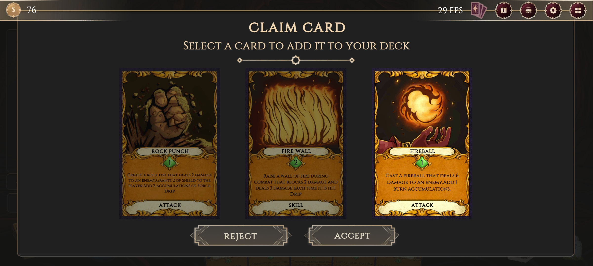

# Arcane Ascent

Arcane Ascent es un juego digital innovador que fusiona un sofisticado sistema de combate basado en cartas con las tradicionales mecánicas del género roguelike. El juego implementa tres especializaciones mágicas distintivas: el Elemental Mage, especializado en el dominio de los elementos naturales; el Summoner Mage, dedicado a la convocación de entidades sobrenaturales; y el Blood Mage, experto en la manipulación de la esencia vital. La estructura técnica del juego se desarrolla sobre Unity con C#, incorporando rigurosamente los principios SOLID y metodologías ágiles de desarrollo. Una característica particularmente notable es su sistema evolutivo de cartas, donde cada especialización cuenta con una biblioteca única y exclusiva de cartas mágicas.

## Historia

En el amanecer de la historia, cuando los Vientos de la Magia barrieron el mundo, surgió un inmenso poder en defensa contra la ambición de una singular Reina Bruja en su imponente Torre. Esta intentó dominar la esencia misma de la magia, pero la magia, caprichosa y salvaje, resistió su control, desencadenando un cataclismo masivo que atrapó a ella y a todo su séquito durante mil años. Este cataclismo mágico no solo sacudió los fundamentos del mundo sino que también despertó a los dioses y a los elementos mismos, corrompiendo con su influencia corruptora a todas las personas de la Torre. En la actualidad, después de mil años de cautiverio, la puerta de la torre ha sido finalmente abierta, atrayendo a cientos de brujos de todos los rincones del mundo que ansían el poder que yace al final de esta Torre.

## Características Principales

### Sistema de Mazo Estratégico

Permite la construcción de mazos poderosos mediante cientos de combinaciones posibles, optimizando así la estrategia en cada enfrentamiento

### Exploración Única

Cada ascenso por la torre presenta una experiencia diferenciada gracias a:

* Encuentros generados proceduralmente
* Eventos aleatorios
* Variadas combinaciones de cartas
* Amplia variedad de enemigos y jefes

### Control Total

Las decisiones tomadas ejercen una influencia directa en el combate y definen el estilo de juego, conduciendo a resultados impredecibles

### Estilos de Combate Diversificados

 Cada brujo cuenta con un estilo de combate único y exclusivo, ofreciendo múltiples formas creativas de derrotar a los adversarios

## Estado Actual y Desarrollo

* Disponible en Early Access.
* Se mantiene activa la participación de la comunidad de desarrolladores.
* Se implementa continuamente la retroalimentación para mejorar y expandir el juego.

## Idiomas Soportados

| Idioma        | Interfaz | Audio | Subtítulos |
|---------------|----------|-------|------------|
| Español       | ✓        | ✗     | ✓          |
| Francés       | ✓        | ✗     | ✓          |
| Alemán        | ✓        | ✗     | ✓          |
| Italiano      | ✓        | ✗     | ✓          |
| Portugués     | ✓        | ✗     | ✓          |
| Chino Simplificado| ✓    | ✗     | ✓          |
| Chino Tradicional| ✓    | ✗     | ✓          |
| Coreano       | ✓        | ✗     | ✓          |
| Japonés       | ✓        | ✗     | ✓          |
| Ruso          | ✓        | ✗     | ✓          |
| Inglés        | ✓        | ✗     | ✓          |

## Tecnologías Utilizadas

* **Unity**: Motor gráfico seleccionado para la generación del juego
* **C#**: Lenguaje de programación utilizado para el desarrollo del código del proyecto
* **Python**: Implementado en paralelo para la generación de idiomas durante el tiempo de indexación
* **OpenAI**: Biblioteca de Python utilizada para la automatización de la generación de idiomas mediante modelos NLP
* **Steamworks**: Manejo de la biblioteca de steam para desarrollar el sistema de logros.

## Información Comercial

* El precio establecido es de $14.99 USD
* La plataforma de distribución es PC (Steam)
* Las características disponibles en Steam incluyen:
  * Logros de Steam
  * Modo un jugador
  * Compartir Familia

## Documentacion

La [documentacion](./Wiki.md) esta dada sobre la base del codigo, uso y configuracion del motor grafico. Manejo de elementos, escenas y todo lo que concierne al desarrollo del proyecto para Developers.

------

