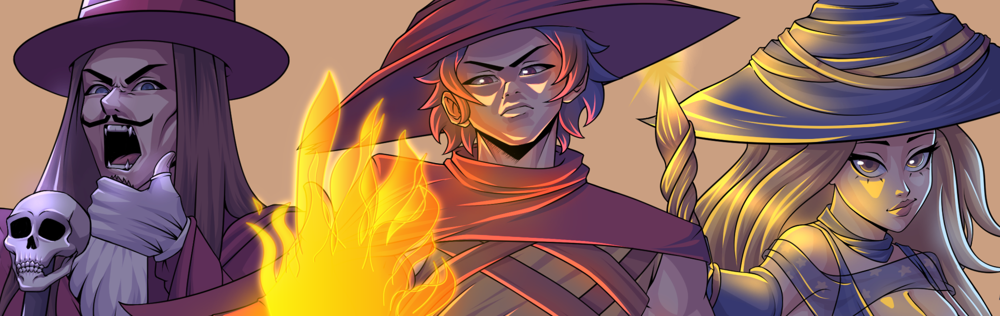
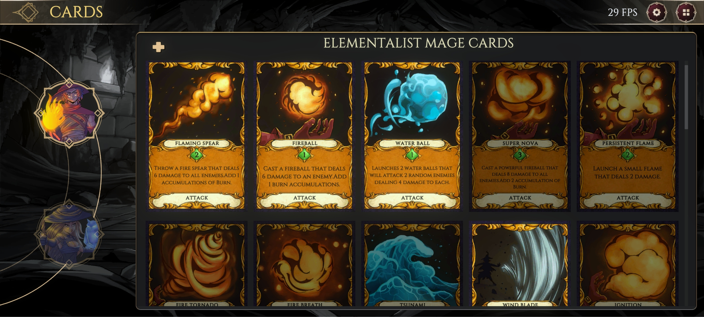
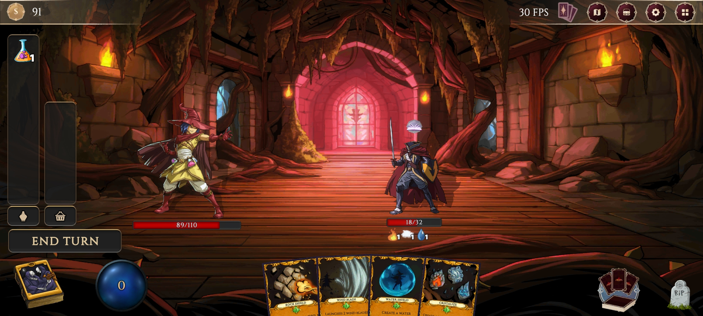
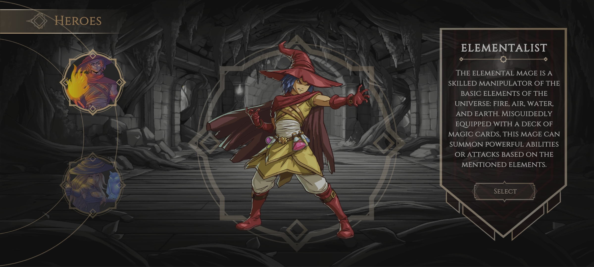

# Arcane Ascent

Arcane Ascent is an innovative digital game that fuses a sophisticated card-based combat system with the traditional mechanics of the roguelike genre. The game implements three distinctive magical specializations: the Elemental Mage, specialized in the mastery of natural elements; the Summoner Mage, dedicated to the summoning of supernatural entities; and the Blood Mage, skilled in the manipulation of life essence. The technical structure of the game is developed on Unity with C#, rigorously incorporating SOLID principles and agile development methodologies. A particularly notable feature is its evolutionary card system, where each specialization has a unique and exclusive library of magic cards.

## History

At the dawn of history, when the Winds of Magic swept the world, immense power arose in defense against the ambition of a singular Witch Queen in her towering Tower. She attempted to master the very essence of magic, but magic, capricious and wild, resisted her control, unleashing a massive cataclysm that trapped her and her entire entourage for a thousand years. This magical cataclysm not only shook the foundations of the world but also awakened the gods and the elements themselves, corrupting all the people of the Tower with its corrupting influence. Today, after a thousand years of captivity, the Tower's door has finally been opened, attracting hundreds of sorcerers from all corners of the world who crave the power that lies at the bottom of this Tower.

## Main Features

### Strategic Deck System

Allows the construction of powerful decks through hundreds of possible combinations, thus optimizing the strategy in each confrontation.

### Unique Exploration

Each ascent through the tower presents a differentiated experience thanks to:

* Procedurally generated encounters
* Random events
* Varied card combinations
* Wide variety of enemies and bosses

### Total Control

Decisions made have a direct influence on combat and define the style of play, leading to unpredictable results.

### Diversified Combat Styles

 Each warlock has a unique and exclusive combat style, offering multiple creative ways to defeat opponents.

## Current Status and Development

* Available in Early Access.
* Active participation of the developer community is maintained.
* Continuously implementing feedback to improve and expand the game.

## Languages Supported

| Language | Interface | Audio | Subtitles |
|---------------|----------|-------|------------|
| Spanish | ✓ | ✗ | ✓ |
| French | ✓ | ✗ | ✓ |
| German | ✓ | ✗ | ✓ |
| Italian | ✓ | ✗ | ✓ | 
| Portuguese | ✓ | ✗ | ✓ |
| Simplified Chinese| ✓ | ✗ | ✓ |
| Traditional Chinese| ✓ | ✗ | ✓ |
| Korean | ✓ | ✗ | ✓ |
| Japanese | ✓ | ✗ | ✓ |
| Russian ✓ | ✗ | ✓ |
| English | ✓ | ✓ | ✓ |

## Technologies Used

* **Unity**: Graphics engine selected for the generation of the game.
* **C#**: Programming language used for the development of the project's code.
* **Python**: Implemented in parallel for language generation during the indexing time
* **OpenAI**: Python library used for the automation of language generation using NLP models
* **Steamworks**: Steam library management to develop the achievement system.

## Commercial Information

* The established price is $14.99 USD
* The distribution platform is PC (Steam)
* Features available on Steam include:
  * Steam Achievements
  * Modo un jugador
  * Compartir Familia

## Documentation

The [documentation](./Doc/Wiki.md) is given on the basis of the code, use and configuration of the graphics engine. Handling of elements, scenes and everything concerning the development of the project for Developers.

------

